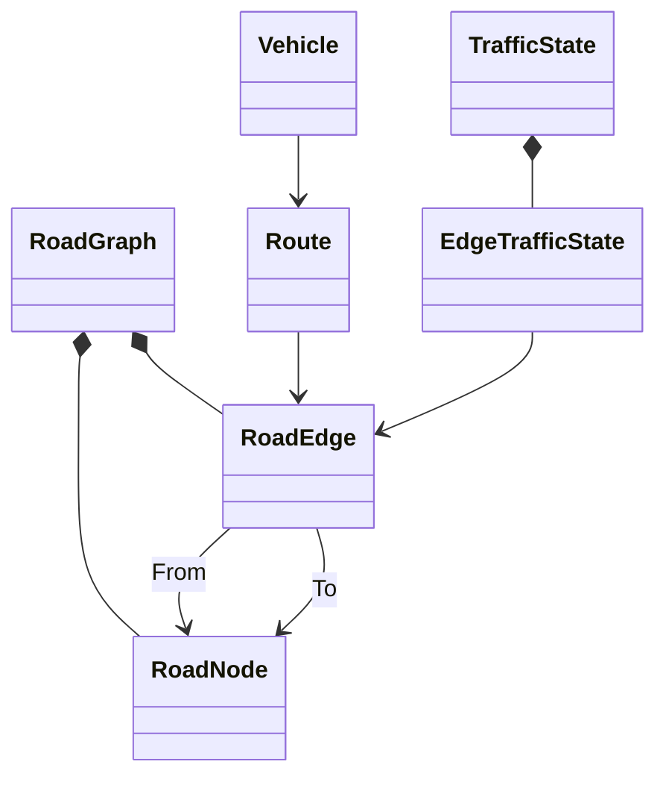
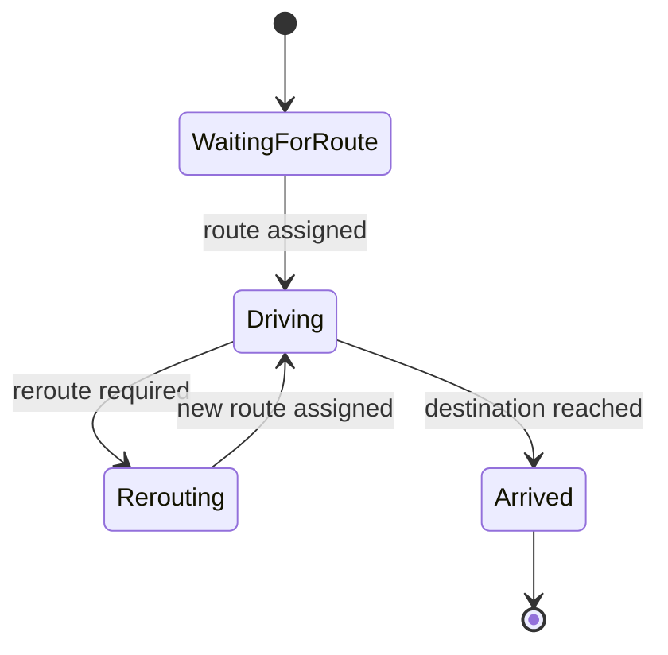
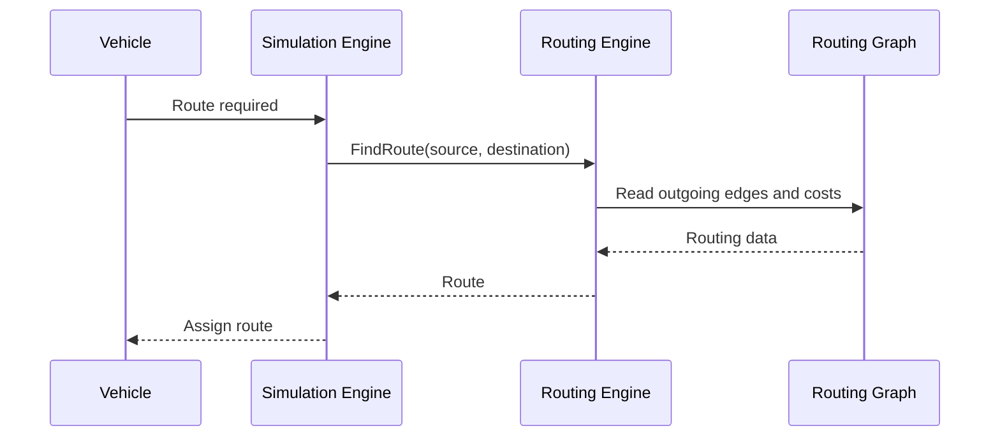
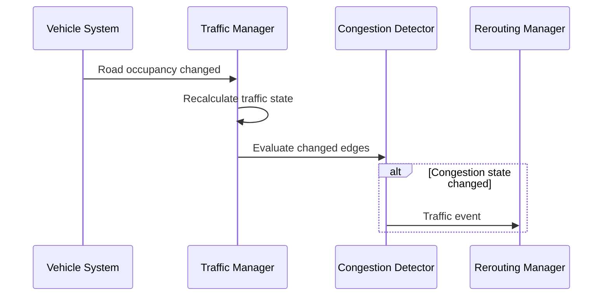
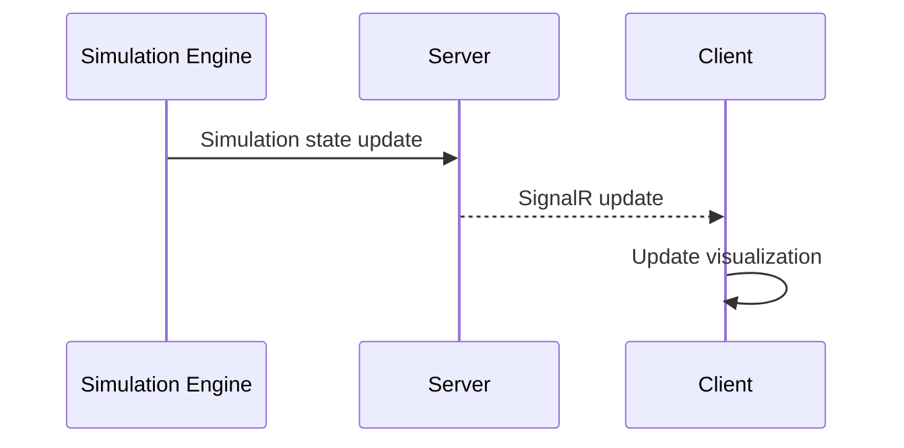

# Simplified Waze — System Architecture

## Table of Contents

1. [Project Overview](#1-project-overview)
2. [Architecture Goals](#2-architecture-goals)
3. [Technology Stack](#3-technology-stack)
4. [High-Level Architecture](#4-high-level-architecture)

5. [Project Structure](#5-project-structure)
   - [Waze.Core](#51-wazecore)
   - [Waze.Simulation](#52-wazesimulation)
   - [Waze.Server](#53-wazeserver)
   - [Waze.Client](#54-wazeclient)
   - [Tests and Benchmarks](#55-tests-and-benchmarks)

6. [Domain Model](#6-domain-model)
   - [Road Graph](#61-road-graph)
   - [Road Node](#62-road-node)
   - [Road Edge](#63-road-edge)
   - [Vehicle](#64-vehicle)
   - [Route](#65-route)
   - [Traffic State](#66-traffic-state)

7. [Road Graph Architecture](#7-road-graph-architecture)
   - [Graph Representation](#71-graph-representation)
   - [Static Topology](#72-static-topology)
   - [Dynamic Edge State](#73-dynamic-edge-state)
   - [Graph Access and Indexes](#74-graph-access-and-indexes)

8. [Routing Architecture](#8-routing-architecture)
   - [Routing Abstraction](#81-routing-abstraction)
   - [IRoutePlanner](#82-irouteplanner)
   - [Dijkstra Baseline](#83-dijkstra-baseline)
   - [Future Routing Algorithms](#84-future-routing-algorithms)

9. [Simulation Architecture](#9-simulation-architecture)
   - [Simulation Engine](#91-simulation-engine)
   - [Simulation Clock and Ticks](#92-simulation-clock-and-ticks)
   - [Vehicle Lifecycle](#93-vehicle-lifecycle)
   - [Vehicle Movement](#94-vehicle-movement)

10. [Traffic and Congestion](#10-traffic-and-congestion)
    - [Traffic Model](#101-traffic-model)
    - [Road Capacity](#102-road-capacity)
    - [Congestion Detection](#103-congestion-detection)
    - [Traffic Updates](#104-traffic-updates)

11. [Rerouting Architecture](#11-rerouting-architecture)
    - [Rerouting Triggers](#111-rerouting-triggers)
    - [Affected Vehicle Detection](#112-affected-vehicle-detection)
    - [Selective Rerouting](#113-selective-rerouting)
    - [Route Replacement](#114-route-replacement)

12. [Concurrency Architecture](#12-concurrency-architecture)
    - [Parallel Components](#121-parallel-components)
    - [Routing Workers](#122-routing-workers)
    - [Shared State](#123-shared-state)
    - [Synchronization Strategy](#124-synchronization-strategy)
    - [Serial Components](#125-serial-components)

13. [Caching and Preprocessing](#13-caching-and-preprocessing)
    - [Route Cache](#131-route-cache)
    - [Cache Invalidation](#132-cache-invalidation)
    - [Graph Preprocessing](#133-graph-preprocessing)
    - [Graph Partitioning](#134-graph-partitioning)

14. [Server Architecture](#14-server-architecture)
    - [ASP.NET Core API](#141-aspnet-core-api)
    - [Simulation Control](#142-simulation-control)
    - [State Queries](#143-state-queries)
    - [Real-Time Updates](#144-real-time-updates)

15. [Client Architecture](#15-client-architecture)
    - [Simulation Dashboard](#151-simulation-dashboard)
    - [Map Visualization](#152-map-visualization)
    - [Vehicle Visualization](#153-vehicle-visualization)
    - [Traffic Visualization](#154-traffic-visualization)
    - [Metrics Display](#155-metrics-display)

16. [Main System Flows](#16-main-system-flows)
    - [Route Request Flow](#161-route-request-flow)
    - [Simulation Tick Flow](#162-simulation-tick-flow)
    - [Traffic Update Flow](#163-traffic-update-flow)
    - [Rerouting Flow](#164-rerouting-flow)
    - [Client Update Flow](#165-client-update-flow)

17. [Metrics and Observability](#17-metrics-and-observability)
    - [Routing Metrics](#171-routing-metrics)
    - [Simulation Metrics](#172-simulation-metrics)
    - [Concurrency Metrics](#173-concurrency-metrics)

18. [Testing Architecture](#18-testing-architecture)
    - [Unit Tests](#181-unit-tests)
    - [Integration Tests](#182-integration-tests)
    - [Concurrency Tests](#183-concurrency-tests)
    - [Stress Tests](#184-stress-tests)

19. [Extensibility](#19-extensibility)
    - [Adding a Routing Algorithm](#191-adding-a-routing-algorithm)
    - [Adding a Traffic Model](#192-adding-a-traffic-model)
    - [Adding an Optimization](#193-adding-an-optimization)

20. [Known Architectural Challenges](#20-known-architectural-challenges)

21. [Related Documentation](#21-related-documentation)


# Simplified Waze — System Architecture

## 1. Project Overview

### 1.1 Purpose

**Simplified Waze** is a dynamic road-navigation simulation designed to model the core behavior of a navigation system such as Waze.

The system operates on a road network represented as a graph, calculates routes between source and destination nodes, simulates the movement of many vehicles, detects changes in traffic conditions, and dynamically reroutes affected vehicles when road conditions change.

The project is also intended to serve as an experimental platform for studying and comparing different routing algorithms, optimization techniques, and parallel-processing strategies.

---

### 1.2 Core System Responsibilities

The system is responsible for the following major tasks:

- Representing a road network as a directed weighted graph.
- Calculating routes between arbitrary source and destination nodes.
- Simulating multiple vehicles moving simultaneously through the road network.
- Updating road conditions dynamically according to simulated traffic.
- Detecting congestion and congestion release.
- Updating road costs when traffic conditions change.
- Identifying vehicles affected by road-condition changes.
- Recalculating routes when a better or necessary alternative exists.
- Executing suitable operations in parallel.
- Measuring the performance and scalability of different implementations.
- Visualizing the simulation through a graphical client.

At a high level, the system behaves as follows:

```text
Road Graph
    │
    ▼
Route Calculation
    │
    ▼
Vehicle Simulation
    │
    ▼
Traffic Changes
    │
    ▼
Road Cost Updates
    │
    ▼
Affected Vehicle Detection
    │
    ▼
Rerouting
    │
    └───────────────┐
                    │
                    ▼
              Vehicle Simulation
```

This process continues throughout the lifetime of the simulation.

---

### 1.3 Road Network Model

The road network is represented as a graph:

$$
G = (V, E)
$$

where:

- $V$ is the set of road intersections.
- $E$ is the set of directed road segments.

Each edge represents a road segment and contains information such as:

- road length;
- speed limit;
- current traffic level;
- estimated travel time;
- current routing cost.

The routing cost of an edge is therefore not necessarily static.

Conceptually:

$$
cost(e) = f(
length,
speedLimit,
traffic,
otherFactors
)
$$

The exact cost function is considered part of the traffic model and may evolve during development.

---

### 1.4 Dynamic Behavior

Unlike a static shortest-path problem, the graph changes while the simulation is running.

For example:

```text
Initial state:

A ----4----> B ----3----> C
```

After congestion develops:

```text
Updated state:

A ----15---> B ----3----> C
```

The graph topology may remain unchanged while the **effective cost of its edges changes over time**.

As a result, an already calculated route may become inefficient.

The system must therefore support the following cycle:

```text
Route calculated
      │
      ▼
Vehicle starts driving
      │
      ▼
Traffic state changes
      │
      ▼
Relevant edge costs change
      │
      ▼
Current route may no longer be optimal
      │
      ▼
Rerouting decision
```

---

### 1.5 Simulation

The project does not model human drivers.

Vehicles are autonomous simulation entities whose behavior is controlled entirely by the simulation engine.

Each vehicle has, at minimum:

- a source;
- a destination;
- a current position;
- a current route;
- a current road segment;
- a current speed;
- a lifecycle state.

A typical vehicle lifecycle is:

```text
Created
   │
   ▼
Waiting For Route
   │
   ▼
Driving
   │
   ├──────> Rerouting ──────┐
   │                        │
   │<───────────────────────┘
   │
   ▼
Arrived
```

The movement of all vehicles influences the state of the road network.

As the number of vehicles on a road increases, the road may become slower or more expensive to traverse.

---

### 1.6 Routing

Routing is treated as a separate subsystem.

The simulation engine does not depend on a specific shortest-path algorithm.

Instead, routing algorithms are accessed through a common abstraction.

Conceptually:

```text
Simulation Engine
       │
       ▼
  IRoutePlanner
       │
       ├── Dijkstra
       ├── Dynamic Shortest Paths
       ├── Contraction Hierarchies
       └── Other Algorithms
```

The initial implementation uses **Dijkstra's algorithm** as the baseline.

Additional routing algorithms can later be introduced and benchmarked against the baseline without redesigning the simulation engine.

---

### 1.7 Parallelism

The system is expected to process many independent or partially independent operations.

Potentially parallel workloads include:

- route calculations for different vehicles;
- vehicle updates;
- traffic-state calculations;
- preprocessing;
- rerouting calculations;
- metric collection.

Parallelism is not introduced automatically into every component.

Each parallelization decision must consider:

- expected performance gain;
- synchronization cost;
- shared-state access;
- race conditions;
- lock contention;
- implementation complexity.

Some components may intentionally remain sequential when parallel execution does not provide a meaningful benefit.

---

### 1.8 Performance and Experimentation

Performance measurement is a first-class part of the project.

The system should support controlled experiments comparing configurations such as:

```text
Dijkstra
        vs
Parallel Dijkstra
        vs
Dijkstra + Cache
        vs
Dynamic Routing
        vs
Advanced Routing Algorithms
```

Measurements may include:

- mean routing latency;
- median routing latency;
- P95 routing latency;
- routes per second;
- simulation throughput;
- memory usage;
- CPU utilization;
- cache hit rate;
- rerouting frequency;
- scalability with increasing worker count;
- scalability with increasing graph size;
- scalability with increasing vehicle count.

Every significant optimization should therefore be evaluated against a measurable baseline.

---

### 1.9 User Interface

The final system includes a graphical client used to observe and control the simulation.

The client is not responsible for routing or simulation logic.

Its purpose is to visualize the state produced by the backend.

The client may display:

- the road network;
- active vehicles;
- current vehicle routes;
- congested roads;
- rerouting events;
- simulation state;
- routing metrics;
- performance metrics.

Conceptually:

```text
┌────────────────────────────────────────────┐
│             Simulation Client              │
│                                            │
│  Road Map                    Metrics       │
│                                            │
│  ●──────●──────●             Vehicles      │
│  │  🚗  │      │             Routes/sec    │
│  ●──────●──────●             Reroutes      │
│       🚗                       Congestion    │
│                                            │
└─────────────────────┬──────────────────────┘
                      │
                      ▼
                 Backend API
                      │
                      ▼
               Simulation Engine
```

The client is therefore treated as a **visualization and control layer**, not as part of the core routing system.

---

### 1.10 Project Scope

The goal is not to reproduce every feature of the real Waze platform.

The project focuses on the algorithmic and systems aspects of dynamic navigation:

- graph-based routing;
- dynamic edge costs;
- traffic simulation;
- rerouting;
- parallelism;
- algorithmic optimization;
- performance analysis;
- graphical visualization.

Features unrelated to these goals should not increase the complexity of the core system unless they provide clear architectural, algorithmic, or experimental value.

---

## 2. Architecture Goals

The architecture is designed around several explicit goals.

These goals should guide implementation decisions throughout the project.

---

### 2.1 Separation of Concerns

Each major subsystem should have a clearly defined responsibility.

In particular:

```text
Road Graph
    │
    │ stores
    ▼
Road topology and road state

Routing Engine
    │
    │ calculates
    ▼
Routes

Simulation Engine
    │
    │ manages
    ▼
Vehicles and simulation time

Traffic System
    │
    │ determines
    ▼
Traffic and congestion state

Server
    │
    │ exposes
    ▼
System functionality

Client
    │
    │ visualizes
    ▼
Simulation state
```

A component should not perform work that belongs to another subsystem unless there is a clear architectural reason.

---

### 2.2 Core Logic Must Be Independent of the UI

The routing and simulation systems must be able to operate without the graphical client.

The following dependency is allowed:

```text
Client
   ↓
Server
   ↓
Simulation
   ↓
Core
```

The opposite direction is not allowed:

```text
Core
   X
   ↓
Client
```

For example, `DijkstraRoutePlanner` must not know:

- whether React exists;
- how a road is drawn;
- what color represents congestion;
- whether the simulation is currently being viewed by a user.

> [!IMPORTANT]
> The UI is a consumer of simulation state, not the owner of simulation logic.

This separation allows the system to be executed from:

- automated tests;
- benchmarks;
- a console application;
- the server;
- future clients.

---

### 2.3 Routing Algorithm Independence

The architecture should not depend on Dijkstra specifically.

Routing must be exposed through an abstraction such as:

```csharp
public interface IRoutePlanner
{
    Route FindRoute(
        NodeId source,
        NodeId destination
    );
}
```

Possible implementations may include:

```text
IRoutePlanner
    │
    ├── DijkstraRoutePlanner
    │
    ├── DynamicRoutePlanner
    │
    ├── ContractionHierarchyRoutePlanner
    │
    └── DeltaSteppingRoutePlanner
```

This allows algorithms to be:

- replaced;
- compared;
- tested independently;
- benchmarked under identical workloads.

---

### 2.4 Clear Separation Between Static and Dynamic Graph State

The road network contains two conceptually different types of information.

#### Static topology

Examples:

- nodes;
- edge connectivity;
- road length;
- permanent road metadata.

#### Dynamic state

Examples:

- number of vehicles;
- congestion;
- current speed;
- current travel time;
- current edge cost.

These concerns should be separated wherever practical.

Conceptually:

```text
Road Graph
├── Static Topology
│   ├── Nodes
│   ├── Edges
│   └── Connectivity
│
└── Dynamic Traffic State
    ├── Vehicle Count
    ├── Congestion
    ├── Current Speed
    └── Current Cost
```

This separation is especially important for concurrency because routing workers may read graph topology very frequently while traffic state changes concurrently.

---

### 2.5 Extensibility

The architecture should allow new algorithms and optimizations to be introduced without rewriting unrelated components.

Examples include:

- a new routing algorithm;
- a new traffic-cost function;
- a new congestion-detection strategy;
- route caching;
- graph partitioning;
- graph preprocessing;
- selective rerouting;
- Contraction Hierarchies;
- Delta Stepping.

For example, adding a routing algorithm should ideally require:

```text
Implement IRoutePlanner
        │
        ▼
Register implementation
        │
        ▼
Run existing correctness tests
        │
        ▼
Run existing benchmarks
```

and should not require changing the vehicle simulation.

---

### 2.6 Measurability

Performance-sensitive components must be measurable.

The architecture should expose sufficient metrics to determine:

- whether an optimization improves performance;
- where bottlenecks exist;
- how the system scales;
- whether parallelism provides useful speedup.

Therefore measurement must not be treated as an afterthought.

Examples:

```text
Route request
    │
    ├── start timestamp
    │
    ▼
Routing
    │
    ▼
Route result
    │
    └── latency recorded
```

Metrics should be collected in a way that introduces minimal interference with the workload being measured.

---

### 2.7 Benchmarkability

Algorithms and optimizations should be testable under reproducible workloads.

A benchmark configuration should be able to specify parameters such as:

```text
Graph size
Vehicle count
Routing algorithm
Worker count
Traffic update frequency
Cache state
Simulation duration
```

For example:

```text
Graph:        50,000 vertices
Vehicles:     10,000
Algorithm:    Dijkstra
Workers:      4
Cache:        OFF
Traffic:      OFF
```

can be compared with:

```text
Graph:        50,000 vertices
Vehicles:     10,000
Algorithm:    Dijkstra
Workers:      8
Cache:        OFF
Traffic:      OFF
```

Only one controlled change should be introduced when the goal is to measure the effect of a specific optimization.

---

### 2.8 Concurrency Safety

Parallelism must not compromise correctness.

Any shared mutable state must have a clearly defined synchronization strategy.

For shared state, the architecture should answer:

1. Who owns the state?
2. Who may read it?
3. Who may modify it?
4. Can multiple readers access it concurrently?
5. Can multiple writers modify it concurrently?
6. What synchronization mechanism is required?

For example:

```text
TrafficManager
      │
      │ writes
      ▼
 Traffic State
      ▲
      │ reads
      │
Routing Workers
```

Potential synchronization strategies may include:

- immutable objects;
- snapshots;
- locks;
- reader/writer locks;
- atomic operations;
- concurrent collections;
- message passing.

The chosen strategy should depend on the access pattern rather than on a single synchronization mechanism used everywhere.

---

### 2.9 Correctness Before Optimization

The first implementation of a feature should prioritize correctness and clarity.

The intended progression is:

```text
Correct implementation
        ↓
Tests
        ↓
Baseline measurement
        ↓
Identify bottleneck
        ↓
Optimization
        ↓
Measurement
```

not:

```text
Complex optimization
        ↓
Hope that it works
```

Dijkstra therefore serves as a simple and well-understood routing baseline before more sophisticated algorithms are introduced.

---

### 2.10 Incremental Development

The architecture should allow the project to remain executable after each major development stage.

A possible progression is:

```text
Road Graph
    ↓
Dijkstra
    ↓
Basic Vehicle Model
    ↓
Simulation
    ↓
Traffic
    ↓
Rerouting
    ↓
Parallel Routing
    ↓
Caching
    ↓
Dynamic Routing
    ↓
Advanced Algorithms
```

Each stage should leave the project in a usable and testable state.

This reduces the risk of introducing multiple interacting systems before the previous layer has been validated.

---

### 2.11 Observability

The system should make its internal behavior understandable during both development and simulation.

Useful information includes:

- number of active vehicles;
- number of route requests;
- route-calculation latency;
- rerouting count;
- number of congested edges;
- cache hit/miss count;
- worker utilization;
- queue sizes;
- simulation tick duration.

Observability serves two purposes:

1. understanding what the system is currently doing;
2. diagnosing performance and correctness problems.

---

### 2.12 Reproducibility

Experiments should be reproducible wherever possible.

If randomness is used for:

- vehicle creation;
- source/destination selection;
- traffic events;
- simulation scenarios;

the simulation should support a configurable random seed.

Example:

```text
RandomSeed = 481516
```

Running the same benchmark with the same:

- graph;
- seed;
- configuration;
- code version;

should produce a sufficiently similar workload for meaningful comparison.

---

### 2.13 Testability

Core components should be designed so they can be tested independently.

For example:

```text
RoadGraph
   ↓
unit tests

DijkstraRoutePlanner
   ↓
unit tests

TrafficManager
   ↓
unit tests

ReroutingManager
   ↓
unit tests

Complete simulation flow
   ↓
integration tests
```

Components should avoid unnecessary dependencies on global state or UI infrastructure because those dependencies make isolated testing more difficult.

---

### 2.14 Controlled Complexity

The architecture should remain as simple as possible while supporting the required behavior.

A new abstraction, cache, worker, index, or synchronization mechanism should be introduced only when it solves a concrete problem.

> [!NOTE]
> Flexibility is useful only when there is a realistic extension point.  
> The project should avoid adding abstractions solely for hypothetical future requirements.

Advanced algorithms such as Contraction Hierarchies or Delta Stepping should therefore be integrated only after the baseline architecture is sufficiently stable.

---

### 2.15 Documentation as Part of the Architecture

Significant technical decisions should remain understandable after they are implemented.

The architecture is therefore accompanied by:

```text
docs/
├── architecture.md
├── decisions/
├── algorithms/
├── research/
├── benchmarks/
└── concurrency.md
```

The architecture document describes the **current structure of the system**.

Historical reasoning should be stored separately:

- **ADR** — why an architectural decision was made.
- **Design Decision** — why a local design approach was selected.
- **Research Note** — what was learned from external research.
- **Algorithm Documentation** — how an implemented algorithm works.
- **Benchmark Journal** — how performance was measured and what was observed.

This prevents `architecture.md` from becoming a chronological development diary.

Documentation should be updated together with the code change it describes whenever possible.

If a commit introduces a significant architectural change, algorithmic change, optimization, or concurrency-related modification, the relevant documentation should be updated in the same commit.

This creates a direct relationship between the code history and the documentation history:

```text
Code Change
    +
Relevant Documentation Update
    ↓
Same Git Commit
```

A commit hash should be included only when the documentation refers to a specific historical version of the code.

- **Benchmark Journal** — include the exact commit that was measured.
- **Optimization Documentation** — include baseline and optimized commits when comparing performance.

## 3. Technology Stack

The project uses a separated backend/client technology stack.

| Technology | Responsibility |
|---|---|
| **C# / .NET** | Core logic, graph structures, routing algorithms, simulation, concurrency, caching, and performance-sensitive backend code |
| **ASP.NET Core** | Backend server and HTTP API |
| **React + TypeScript** | Graphical client used to visualize and control the simulation |
| **SignalR / WebSocket** | Real-time communication between the server and client |
| **xUnit** | Automated unit and integration testing |
| **BenchmarkDotNet** | Low-level .NET performance benchmarks |
| **Custom Benchmark Runner** | End-to-end simulation and scalability benchmarks |
| **Git** | Version control and project history |
||


The core routing and simulation logic should remain independent of presentation and transport technologies such as React, SignalR, and ASP.NET Core.

Conceptually:

```text
React + TypeScript
        │
        ▼
 ASP.NET Core
        │
        ▼
Simulation / Core
        │
        ▼
C# / .NET
```

This separation allows the client, server, routing algorithms, and simulation components to evolve independently.


## 4. High-Level Architecture

The system is divided into several major layers, each with a clearly defined responsibility.

```text
┌──────────────────────────────┐
│        Waze.Client           │
│   Visualization & Control    │
└──────────────┬───────────────┘
               │
        HTTP / SignalR
               │
┌──────────────▼───────────────┐
│        Waze.Server           │
│      API & Communication     │
└──────────────┬───────────────┘
               │
┌──────────────▼───────────────┐
│      Waze.Simulation         │
│                              │
│ Vehicles                     │
│ Simulation Clock             │
│ Traffic Updates              │
│ Congestion Detection         │
│ Rerouting                    │
└──────────────┬───────────────┘
               │
┌──────────────▼───────────────┐
│         Waze.Core            │
│                              │
│ Road Graph                   │
│ Routing Abstractions         │
│ Routing Algorithms           │
│ Core Domain Models           │
└──────────────────────────────┘
```

### 4.1 Layer Responsibilities

#### `Waze.Core`

Contains the core domain model and algorithmic functionality.

Main responsibilities include:

- road graph representation;
- graph-related data structures;
- routing abstractions;
- routing algorithms;
- core entities such as roads, nodes, and routes.

`Waze.Core` must remain independent of the simulation, server, and client layers.

---

#### `Waze.Simulation`

Coordinates the dynamic behavior of the system.

Main responsibilities include:

- managing simulation time;
- creating and updating vehicles;
- moving vehicles along routes;
- updating traffic state;
- detecting congestion;
- determining when rerouting is required;
- requesting routes from the routing subsystem.

The simulation layer uses `Waze.Core`, but the core layer does not depend on the simulation.

---

#### `Waze.Server`

Acts as the communication boundary between the simulation and external clients.

Main responsibilities include:

- exposing simulation-control operations;
- exposing current system state;
- receiving client commands;
- publishing real-time simulation updates.

The server should delegate simulation and routing logic to the appropriate lower-level components rather than implementing domain logic itself.

---

#### `Waze.Client`

Provides the graphical interface for observing and controlling the system.

Main responsibilities include:

- displaying the road network;
- displaying vehicles and their routes;
- visualizing congestion;
- showing simulation and performance metrics;
- sending simulation-control commands to the server.

The client does not perform routing or simulation calculations.

---

### 4.2 Dependency Direction

Dependencies should flow from higher-level presentation components toward the core domain:

```text
Waze.Client
     │
     ▼
Waze.Server
     │
     ▼
Waze.Simulation
     │
     ▼
Waze.Core
```

Dependencies in the opposite direction should be avoided.

For example:

```text
Allowed:

Waze.Simulation -> Waze.Core
```

```text
Not Allowed:

Waze.Core -> Waze.Simulation
Waze.Core -> Waze.Server
Waze.Core -> Waze.Client
```

> [!IMPORTANT]
> Lower-level components should not depend on higher-level presentation or transport layers.

---

### 4.3 Main Runtime Flow

A typical route request follows this path:

```text
Vehicle
   │
   ▼
Simulation Engine
   │
   ▼
Routing Engine
   │
   ▼
Road Graph + Traffic State
   │
   ▼
Route
   │
   ▼
Vehicle
```

During the simulation, this cycle may repeat when traffic conditions change:

```text
Vehicle Movement
      │
      ▼
Traffic State Update
      │
      ▼
Congestion Detection
      │
      ▼
Affected Vehicle Detection
      │
      ▼
Rerouting
      │
      ▼
Vehicle Movement
```

The client observes this process through the server but does not participate in the routing or traffic calculations.

---

### 4.4 Architectural Boundary Principle

Each layer should expose only the functionality required by the layer above it.

For example:

```text
Client
   │
   │ StartSimulation()
   ▼
Server
   │
   │ Start()
   ▼
Simulation Engine
```

The client should not need to know how vehicles are stored, how Dijkstra is implemented, or how traffic state is synchronized.

Similarly, the routing engine should not need to know whether its result will be displayed in a browser, used in a benchmark, or verified by a test.

This separation keeps the system modular and allows individual components to be replaced or extended without redesigning the entire project.


## 5. Project Structure

The solution is divided into independent projects according to responsibility.

The initial structure is:

```text
Parallel-Project/
│
├── src/
│   ├── Waze.Core/
│   ├── Waze.Simulation/
│   ├── Waze.Server/
│   └── Waze.Client/
│
├── tests/
│   ├── Waze.Core.Tests/
│   ├── Waze.Simulation.Tests/
│   └── Waze.Integration.Tests/
│
├── benchmarks/
│
├── docs/
│   ├── architecture.md
│   ├── concurrency.md
│   ├── decisions/
│   ├── algorithms/
│   ├── research/
│   └── benchmarks/
│
└── README.md
```

The structure may evolve as implementation requirements become clearer.

The primary dependency direction is:

```text
Waze.Client
     │
     ▼
Waze.Server
     │
     ▼
Waze.Simulation
     │
     ▼
Waze.Core
```

Lower-level projects must not depend on higher-level projects.

---

### 5.1 `Waze.Core`

`Waze.Core` contains the fundamental domain model and algorithmic functionality.

Initial responsibilities include:

- road graph representation;
- road nodes and edges;
- routes;
- routing abstractions;
- routing algorithms;
- graph-related indexes;
- shared domain types.

Possible internal structure:

```text
Waze.Core/
│
├── Domain/
│   ├── NodeId.cs
│   ├── EdgeId.cs
│   ├── RoadNode.cs
│   ├── RoadEdge.cs
│   └── Route.cs
│
├── Graph/
│   ├── RoadGraph.cs
│   └── GraphIndexes/
│
└── Routing/
    ├── IRoutePlanner.cs
    ├── DijkstraRoutePlanner.cs
    └── ...
```

`Waze.Core` should not depend on:

- ASP.NET Core;
- React;
- HTTP;
- SignalR;
- visualization code;
- simulation-specific scheduling.

---

### 5.2 `Waze.Simulation`

`Waze.Simulation` contains the dynamic behavior of the system.

Responsibilities include:

- simulation lifecycle;
- simulation clock;
- vehicle creation;
- vehicle movement;
- traffic state;
- congestion detection;
- rerouting decisions;
- coordination between vehicles and routing.

Possible structure:

```text
Waze.Simulation/
│
├── Engine/
│   └── SimulationEngine.cs
│
├── Vehicles/
│   ├── Vehicle.cs
│   ├── VehicleState.cs
│   └── VehicleManager.cs
│
├── Traffic/
│   ├── TrafficState.cs
│   ├── TrafficSnapshot.cs
│   ├── TrafficManager.cs
│   └── CongestionDetector.cs
│
└── Rerouting/
    ├── ReroutingManager.cs
    └── EdgeVehicleIndex.cs
```

The simulation project may depend on `Waze.Core`.

---

### 5.3 `Waze.Server`

`Waze.Server` exposes the simulation to external clients.

Responsibilities include:

- HTTP API;
- simulation commands;
- configuration endpoints;
- querying system state;
- publishing real-time updates;
- mapping internal models to transport models.

Possible structure:

```text
Waze.Server/
│
├── Controllers/
├── Hubs/
├── Services/
├── DTOs/
└── Program.cs
```

The server should contain minimal domain logic.

For example:

```text
HTTP Request
     │
     ▼
Controller
     │
     ▼
Simulation Service
     │
     ▼
Simulation Engine
```

Routing should never be implemented directly inside a controller.

---

### 5.4 `Waze.Client`

`Waze.Client` is the graphical simulation interface.

Responsibilities include:

- displaying the map;
- displaying vehicles;
- displaying routes;
- displaying traffic conditions;
- controlling the simulation;
- displaying metrics;
- receiving real-time updates.

Possible structure:

```text
Waze.Client/
│
├── src/
│   ├── components/
│   ├── map/
│   ├── simulation/
│   ├── metrics/
│   ├── api/
│   └── models/
│
└── package.json
```

The client does not perform routing or simulation calculations.

---

### 5.5 Tests and Benchmarks

Correctness tests and performance benchmarks must remain separated.

```text
tests/
├── Waze.Core.Tests/
├── Waze.Simulation.Tests/
└── Waze.Integration.Tests/

benchmarks/
├── Waze.MicroBenchmarks/
└── Waze.SimulationBenchmarks/
```

Tests answer:

> Is the implementation correct?

Benchmarks answer:

> How does the implementation perform?

A benchmark failure should not replace a correctness test.

---

## 6. Domain Model

The domain model represents the primary concepts of the navigation system.

The initial major entities are:

```text
RoadGraph
├── RoadNode
└── RoadEdge

Vehicle
└── Route
    └── RoadEdge

TrafficState
└── EdgeTrafficState
```

A simplified relationship diagram is:



The exact class layout may change as the implementation evolves.

---

### 6.1 Road Graph

`RoadGraph` represents the road network topology.

Conceptually:

$$
G = (V,E)
$$

where:

- $V$ represents intersections;
- $E$ represents directed road segments.

`RoadGraph` is responsible for operations such as:

- retrieving outgoing edges;
- retrieving nodes and edges by identifier;
- exposing graph topology to routing algorithms;
- maintaining graph-related indexes.

Example:

```text
A ───→ B ───→ C
│
└────→ D
```

could be represented as:

```text
A -> [B, D]
B -> [C]
C -> []
D -> []
```

---

### 6.2 Road Node

`RoadNode` represents an intersection or graph vertex.

At minimum it requires a stable identifier.

Example:

```csharp
public readonly record struct NodeId(int Value);
```

A road node may eventually contain geographic information such as:

```text
Latitude
Longitude
```

if a real road map is used.

Graph algorithms should identify nodes through stable identifiers rather than UI-specific names.

---

### 6.3 Road Edge

`RoadEdge` represents a directed road segment.

Static information may include:

```text
Id
From
To
Length
SpeedLimit
```

Example:

```text
Edge E17

From: A
To: B
Length: 800 m
SpeedLimit: 50 km/h
```

Dynamic traffic information should be stored separately from the immutable road topology where practical.

Therefore:

```text
RoadEdge
    ↓
describes what road exists

EdgeTrafficState
    ↓
describes its current condition
```

---

### 6.4 Vehicle

`Vehicle` represents one simulated vehicle.

A vehicle may contain:

```text
Id
Source
Destination
CurrentEdge
PositionOnEdge
CurrentSpeed
CurrentRoute
RouteIndex
State
```

Typical lifecycle states include:

```text
WaitingForRoute
Driving
Rerouting
Arrived
```

The vehicle should represent its state.

Higher-level coordination decisions should remain in simulation services rather than accumulating all behavior inside the `Vehicle` class.

---

### 6.5 Route

`Route` represents an ordered path through the graph.

Example:

```text
A → B → D → F
```

Internally it may contain ordered edge identifiers:

```text
[E1, E7, E12]
```

Possible properties:

```text
Source
Destination
Edges
TotalDistance
EstimatedTravelTime
TotalCost
```

Routes should preferably be immutable after creation.

When rerouting occurs, the old route is replaced with a new route rather than modified in-place.

This simplifies concurrency and historical reasoning.

---

### 6.6 Traffic State

`TrafficState` represents the dynamic road conditions of the simulation.

For every road edge, dynamic state may include:

```text
VehicleCount
CurrentSpeed
CurrentTravelTime
CurrentCost
IsOpen
CongestionLevel
```

Conceptually:

```text
RoadGraphTopology
        +
TrafficState
        ↓
Current Routable Graph View
```

Routing requires information from both components.

The separation exists because topology and traffic state have different update patterns, ownership, synchronization requirements, and lifecycle.

---

## 7. Road Graph Architecture

The graph subsystem must support efficient routing while also allowing road conditions to change dynamically.

The architecture separates:

```text
Static Graph Topology
        +
Dynamic Traffic State
```

These may be exposed together through a routing-oriented graph view.

---

### 7.1 Graph Representation

The initial graph representation will use an **adjacency list**.

Example:

```text
A -> [E1, E2]
B -> [E3]
C -> [E4, E5]
```

where each entry contains outgoing edges.

Typical complexity:

| Operation | Expected Complexity |
|---|---:|
| Retrieve outgoing edges | $O(1)$ lookup + iteration |
| Traverse all graph edges | $O(V + E)$ |
| Storage | $O(V + E)$ |

An adjacency list is appropriate because road networks are sparse graphs.

---

### 7.2 Static Topology

Static topology describes road connectivity.

Examples:

```text
A → B
B → C
B → D
```

and properties that normally do not change while the simulation is running:

```text
From
To
Length
SpeedLimit
```

The initial architecture treats topology as immutable during normal simulation.

This allows multiple routing workers to safely read it concurrently.

For example:

```text
Worker 1 ─┐
Worker 2 ─┼──→ Immutable Road Topology
Worker 3 ─┤
Worker 4 ─┘
```

No synchronization is required for data that cannot change.

---

### 7.3 Dynamic Edge State

Dynamic edge state contains properties that change during simulation.

Example:

```text
t = 10

E17:
VehicleCount = 4
CurrentCost = 7
```

Later:

```text
t = 20

E17:
VehicleCount = 21
CurrentCost = 18
```

This data may be maintained independently of `RoadEdge`.

For example:

```csharp
public sealed class EdgeTrafficState
{
    public int VehicleCount { get; }
    public double CurrentCost { get; }
    public bool IsOpen { get; }
}
```

The exact mutability strategy will be determined together with the concurrency architecture.

---

### 7.4 Graph Access and Indexes

Different operations require different graph access patterns.

Possible indexes include:

```text
NodeId -> RoadNode
EdgeId -> RoadEdge
NodeId -> Outgoing Edges
```

Later, additional indexes may be added only when they solve a measurable problem.

Examples:

```text
EdgeId -> Vehicles using edge
RegionId -> Nodes
NodeId -> RegionId
```

The routing layer should ideally receive a unified view:

```text
Graph Topology
      +
Traffic Snapshot
      ↓
Routing Graph View
```

so that routing algorithms can access both topology and current edge state without owning either system.

Conceptually:

```csharp
foreach (var edge in graphView.GetOutgoingEdges(node))
{
    if (!edge.IsOpen)
        continue;

    Relax(edge.To, edge.CurrentCost);
}
```

The storage model may remain separated even if the routing API exposes a combined view.

---

## 8. Routing Architecture

Routing is implemented as an independent subsystem.

The simulation should request a route without depending on the specific algorithm used to calculate it.

---

### 8.1 Routing Abstraction

Routing is exposed through a common abstraction.

Conceptually:

```text
Simulation
    │
    ▼
IRoutePlanner
    │
    ├── Dijkstra
    ├── Dynamic Shortest Paths
    ├── Contraction Hierarchies
    └── Delta Stepping
```

This makes routing implementations replaceable.

A routing implementation should receive all information required to calculate a route through explicit dependencies.

---

### 8.2 `IRoutePlanner`

An initial interface may resemble:

```csharp
public interface IRoutePlanner
{
    Route FindRoute(
        NodeId source,
        NodeId destination,
        IRoutingGraph graph);
}
```

The final method signature may change during implementation.

The important architectural requirement is that the caller should depend on the abstraction rather than a concrete algorithm.

This allows:

- algorithm comparison;
- isolated testing;
- benchmark reuse;
- future replacement.

---

### 8.3 Dijkstra Baseline

**Dijkstra's algorithm** will be the first routing implementation.

Its purpose is to provide:

- a correct baseline;
- a simple initial implementation;
- a reference for future optimizations;
- a benchmark comparison point.

Using a heap-based priority queue, expected complexity is approximately:

$$
O((V + E)\log V)
$$

for a sparse graph representation.

The architecture should not be optimized around Dijkstra-specific assumptions that prevent future routing algorithms from being introduced.

---

### 8.4 Future Routing Algorithms

Possible future routing implementations include:

```text
Dynamic Shortest Paths
Contraction Hierarchies
Delta Stepping
Hierarchical Routing
Region-Based Routing
```

Not all algorithms must share identical internal state.

Some may require preprocessing.

For example:

```text
ContractionHierarchyRoutePlanner
        │
        └── Preprocessed hierarchy
```

while:

```text
DynamicRoutePlanner
        │
        └── Maintained dynamic routing state
```

Algorithm-specific data should remain encapsulated inside the corresponding routing implementation or dedicated preprocessing service.

---

## 9. Simulation Architecture

The simulation layer coordinates the dynamic system.

It owns the simulation lifecycle and orchestrates vehicles, traffic, congestion, and rerouting.

---

### 9.1 Simulation Engine

`SimulationEngine` acts as the main simulation coordinator.

Responsibilities include:

- start;
- pause;
- resume;
- stop;
- simulation time;
- advancing ticks;
- invoking vehicle updates;
- invoking traffic updates;
- triggering congestion detection;
- coordinating rerouting.

Conceptually:

```text
SimulationEngine
│
├── VehicleManager
├── TrafficManager
├── CongestionDetector
└── ReroutingManager
```

The engine should coordinate these components rather than implement all of their logic itself.

---

### 9.2 Simulation Clock and Ticks

The initial simulation will use a discrete tick model.

Example:

```text
Tick 1
Tick 2
Tick 3
...
```

Each tick represents a defined interval of simulated time.

For example:

```text
1 tick = 100 ms simulated time
```

The exact duration belongs in a design decision under `docs/decisions/design/`.

A tick may perform operations such as:

```text
Tick
 │
 ├── Update vehicles
 ├── Update traffic
 ├── Detect congestion
 ├── Process rerouting
 └── Collect metrics
```

Not every subsystem must necessarily execute on every tick.

For example, traffic aggregation may be performed every:

```text
10 ticks
```

while vehicle movement occurs every tick.

---

### 9.3 Vehicle Lifecycle

A vehicle follows a defined lifecycle.



Possible future states may include:

```text
Blocked
Failed
Paused
```

if required.

The lifecycle should remain explicit so that invalid state transitions can be detected.

---

### 9.4 Vehicle Movement

During simulation, a vehicle moves along its assigned route.

Conceptually:

```text
CurrentEdge
    │
    ▼
Advance position
    │
    ├── still on edge → continue
    │
    └── reached end
            │
            ▼
        next edge
```

When the destination is reached:

```text
Driving
   ↓
Arrived
```

Vehicle speed may depend on:

```text
Road speed limit
Traffic state
Vehicles ahead
Simulation rules
```

The initial movement model should remain simple and deterministic enough to test.

More realistic movement behavior may be added later if justified.

---

## 10. Traffic and Congestion

Traffic is modeled as dynamic state associated with road edges.

Vehicles influence this state as they move through the network.

---

### 10.1 Traffic Model

The traffic model determines how vehicle presence affects road conditions.

A conceptual relationship is:

```text
More Vehicles
      ↓
Higher Congestion
      ↓
Lower Effective Speed
      ↓
Higher Travel Time
      ↓
Higher Routing Cost
```

The exact mathematical relationship should be configurable and documented separately.

A generic form is:

$$
cost(e) = f(
length(e),
speedLimit(e),
traffic(e)
)
$$

The routing engine should consume the resulting edge cost rather than implement traffic-model logic itself.

---

### 10.2 Road Capacity

A road may have a capacity value representing the approximate number of vehicles it can support before traffic significantly degrades.

Example:

```text
Edge E17

Capacity: 20 vehicles
Current vehicles: 16
```

A simple load ratio can be defined as:

$$
load(e) =
\frac{vehicles(e)}{capacity(e)}
$$

Capacity may later depend on:

- road length;
- number of lanes;
- road category;
- synthetic configuration.

The first implementation may use a simplified model.

---

### 10.3 Congestion Detection

`CongestionDetector` determines whether a road should be considered congested.

A simple initial rule could use:

```text
vehicle count / road capacity
```

Example:

$$
\frac{vehicles(e)}{capacity(e)} \ge threshold
$$

The exact threshold should be treated as a simulation assumption or configuration value.

Two events are important:

```text
CongestionStarted
CongestionCleared
```

Using separate start and clear thresholds may later be considered to prevent rapid oscillation around one boundary.

---

### 10.4 Traffic Updates

Traffic state changes as vehicles:

- enter a road;
- leave a road;
- move through the simulation;
- encounter manually injected events.

Conceptually:

```text
Vehicle enters E17
      ↓
VehicleCount(E17)++
      ↓
Traffic recalculated
      ↓
Cost may change
```

and:

```text
Vehicle leaves E17
      ↓
VehicleCount(E17)--
      ↓
Traffic recalculated
      ↓
Cost may decrease
```

Traffic changes should generate meaningful events only when required.

A tiny numerical cost change should not necessarily trigger immediate system-wide rerouting.

---

## 11. Rerouting Architecture

Rerouting allows vehicles to react to changed road conditions.

The system should avoid recalculating routes for all vehicles after every traffic update.

---

### 11.1 Rerouting Triggers

Possible rerouting triggers include:

- an edge on the current route becomes congested;
- a road becomes unavailable;
- congestion is cleared;
- the expected route cost changes significantly;
- a manual traffic event changes road availability.

A traffic change does not automatically imply that a vehicle must reroute.

The rerouting system determines whether recalculation is justified.

---

### 11.2 Affected Vehicle Detection

When an edge changes, the system first identifies vehicles whose routes may be affected.

Naive approach:

```text
Changed Edge
     ↓
Scan every vehicle
     ↓
Inspect every route
```

This becomes expensive as the number of vehicles increases.

A future optimized approach can maintain:

```text
EdgeId -> Set<VehicleId>
```

Example:

```text
E17 -> {Vehicle4, Vehicle91, Vehicle201}
```

Then:

```text
E17 changed
     ↓
Retrieve affected vehicles
     ↓
Consider only those vehicles
```

The exact indexing design should be documented as a Design Decision when implemented.

---

### 11.3 Selective Rerouting

Affected does not necessarily mean rerouting is useful.

For each affected vehicle, the system may compare:

```text
Current remaining route cost
          vs
New candidate route cost
```

A reroute may occur only if the improvement exceeds a threshold.

Conceptually:

```text
Affected Vehicle
      │
      ▼
Calculate Candidate Route
      │
      ▼
Compare With Current Route
      │
      ├── insignificant improvement → keep route
      │
      └── meaningful improvement → replace route
```

This prevents excessive route switching.

---

### 11.4 Route Replacement

A route should preferably be immutable.

When rerouting:

```text
Old Route
    ↓
New Route calculated
    ↓
Vehicle navigation state updated
```

The update must be concurrency-safe.

The vehicle should never observe an invalid combination such as:

```text
New Route
+
Old Route Index
```

Route replacement may therefore require an atomic or synchronized state transition.

The exact mechanism belongs in the concurrency design.

---

## 12. Concurrency Architecture

Concurrency is a major architectural concern because the system may simulate many vehicles and routing requests simultaneously.

Parallelism should be introduced only when it provides measurable value.

---

### 12.1 Parallel Components

Potentially parallel workloads include:

- route calculations;
- vehicle updates;
- preprocessing;
- rerouting;
- metrics aggregation;
- some traffic calculations.

Initial priority:

```text
Independent Route Requests
        ↓
Routing Worker Pool
```

This is likely to provide useful parallelism with relatively limited interaction between requests.

---

### 12.2 Routing Workers

Independent route requests may be processed by multiple workers.

```text
Route Queue
│
├── Vehicle 10 request
├── Vehicle 91 request
├── Vehicle 142 request
└── Vehicle 301 request
        │
        ▼
┌───────────────┐
│ Routing Pool  │
├───────────────┤
│ Worker 1      │
│ Worker 2      │
│ Worker 3      │
│ Worker 4      │
└───────────────┘
```

Each worker should operate primarily on read-only graph topology and a consistent view of traffic state.

The number of workers must be configurable for scalability benchmarks.

---

### 12.3 Shared State

Shared state should be minimized and explicitly documented.

Potential shared state includes:

```text
Traffic State
Vehicle Collection
Routing Request Queue
Metrics
Edge-to-Vehicle Index
Route Cache
```

For every shared structure the architecture should define:

```text
Owner
Readers
Writers
Consistency requirement
Synchronization strategy
```

Example:

| State | Readers | Writers |
|---|---|---|
| Graph topology | Routing, Simulation | None during runtime |
| Traffic state | Routing, Simulation | Traffic Manager |
| Vehicle state | Simulation, Server | Simulation |
| Route cache | Routing workers | Routing workers |

---

### 12.4 Synchronization Strategy

No single synchronization mechanism should be applied everywhere.

Possible mechanisms include:

- immutable state;
- snapshots;
- locks;
- `ReaderWriterLockSlim`;
- atomic operations;
- concurrent collections;
- channels/message queues.

The preferred order is generally:

```text
Avoid shared mutable state
        ↓
Use immutable/read-only data where possible
        ↓
Use narrow synchronization where required
```

A traffic snapshot is one possible strategy:

```text
Traffic State #42
        │
        ├── Routing Worker 1
        ├── Routing Worker 2
        └── Routing Worker 3

Traffic Manager
        │
        ▼
Creates Traffic State #43
```

Workers already using snapshot `#42` can finish consistently while a new state is prepared.

The exact implementation should be benchmarked before being finalized.

---

### 12.5 Serial Components

Not every operation should be parallel.

Some operations may remain serial because:

- synchronization cost is greater than the expected speedup;
- ordering is required;
- the workload is too small;
- parallelism would make correctness significantly harder.

Example:

```text
Simulation Coordination
        ↓
Sequential

Route Calculations
        ↓
Parallel
```

The decision to keep a component serial should be documented when non-obvious.

Detailed concurrency behavior should also be maintained in `docs/concurrency.md`.

---

## 13. Caching and Preprocessing

Caching and preprocessing are optional optimizations that should be introduced only after a correct baseline exists.

---

### 13.1 Route Cache

Repeated route calculations may be cached.

A naive key is:

```text
(source, destination)
```

However, because road costs change dynamically, such a cache may return stale routes.

A more realistic key may involve:

```text
(source, destination, trafficVersion)
```

Conceptually:

```text
Route Request
      │
      ▼
Cache Lookup
      │
      ├── Hit → Return Route
      │
      └── Miss
             │
             ▼
          Routing
             │
             ▼
         Store Route
```

Caching should be introduced only with a clear invalidation strategy.

---

### 13.2 Cache Invalidation

Cache invalidation is one of the main challenges in a dynamic graph.

Possible strategies include:

- clear all cached routes after any traffic update;
- associate cache entries with a graph/traffic version;
- use time-based expiration;
- track which edges each cached route depends on;
- invalidate only routes using changed edges.

Example:

```text
Cached Route:
A → B → D → F

Changed Edge:
B → D

        ↓

Invalidate this route
```

The initial implementation may intentionally use a simple strategy before introducing selective invalidation.

---

### 13.3 Graph Preprocessing

Some information can be computed before simulation begins.

Potential preprocessing includes:

- node and edge indexes;
- connected components;
- geographic regions;
- important junctions;
- graph partitions;
- algorithm-specific metadata.

Conceptually:

```text
Raw Road Graph
      │
      ▼
Preprocessing
      │
      ▼
Runtime-Optimized Graph Structures
```

Preprocessing cost should be measured separately from route-query cost.

This is important for algorithms that trade expensive initialization for faster queries.

---

### 13.4 Graph Partitioning

The graph may later be divided into regions.

Example:

```text
┌─────────────┬─────────────┐
│  Region A   │  Region B   │
│             │             │
│ A1 → A2     │ B1 → B2     │
│      ↓      │             │
│     A3 ─────┼────→ B1     │
├─────────────┼─────────────┤
│  Region C   │  Region D   │
└─────────────┴─────────────┘
```

Possible benefits include:

- smaller local search spaces;
- localized rerouting;
- preprocessing opportunities;
- improved cache locality;
- future hierarchical routing.

Partitioning should not be added before the baseline routing behavior is validated.

---

## 14. Server Architecture

The server provides a transport boundary between the simulation and external clients.

It should expose capabilities rather than internal implementation details.

---

### 14.1 ASP.NET Core API

The server will use ASP.NET Core.

Possible API areas include:

```text
/api/simulation
/api/vehicles
/api/traffic
/api/configuration
/api/metrics
```

Example operations:

```text
POST /api/simulation/start
POST /api/simulation/pause
POST /api/simulation/reset

POST /api/vehicles
GET  /api/vehicles/{id}

GET  /api/metrics
```

Exact endpoints should be defined when server implementation begins.

---

### 14.2 Simulation Control

The client may send commands such as:

```text
Start
Pause
Resume
Stop
Reset
```

A request flow may be:

```text
Client
   │
   ▼
SimulationController
   │
   ▼
SimulationService
   │
   ▼
SimulationEngine
```

The API layer validates and translates the request.

The simulation engine remains responsible for actual simulation behavior.

---

### 14.3 State Queries

The server may expose current state such as:

- selected vehicle information;
- simulation status;
- aggregate traffic information;
- metrics;
- road information.

The server should avoid exposing internal mutable domain objects directly.

Instead, transport-specific DTOs may be created.

Example:

```csharp
public sealed record VehicleDto(
    int Id,
    double Position,
    string State);
```

This prevents API concerns from leaking into the core domain.

---

### 14.4 Real-Time Updates

Simulation state changes frequently.

The server may use SignalR to push selected updates to the client.

Possible events:

```text
VehiclePositionsUpdated
TrafficUpdated
CongestionStarted
CongestionCleared
VehicleRerouted
MetricsUpdated
```

The server should not necessarily publish every internal event.

For example, if the simulation runs at:

```text
100 ticks / second
```

the UI may only need:

```text
10-20 visual updates / second
```

Separating simulation update frequency from UI update frequency prevents visualization from becoming a performance bottleneck.

---

## 15. Client Architecture

The client provides simulation visualization and control.

It is not part of the routing or simulation domain.

---

### 15.1 Simulation Dashboard

The main interface will act as a simulation dashboard.

Conceptually:

```text
┌───────────────────────────────────────────────────┐
│ Simplified Waze                    ▶  ⏸  ■        │
├────────────────────────────────┬──────────────────┤
│                                │ Vehicles: 10,000 │
│                                │ Congested: 18    │
│           ROAD MAP             │ Routes/sec: 2940 │
│                                │ Reroutes: 251    │
│                                │                  │
│                                │ Algorithm:       │
│                                │ Dijkstra         │
│                                │                  │
│                                │ Workers: 4       │
├────────────────────────────────┴──────────────────┤
│ Simulation Time: 01:42                           │
└───────────────────────────────────────────────────┘
```

The final visual design may change.

---

### 15.2 Map Visualization

The map displays:

- road nodes;
- road edges;
- graph layout or geographic coordinates;
- road state.

The visualization layer consumes data provided by the server.

It should not directly inspect backend data structures.

---

### 15.3 Vehicle Visualization

Vehicles may be displayed as moving markers.

The client receives state such as:

```text
VehicleId
EdgeId
PositionOnEdge
CurrentRoute
State
```

Interpolation may be used client-side to produce smooth animation between server updates.

Interpolation is purely visual and should not alter authoritative simulation state.

---

### 15.4 Traffic Visualization

Roads may visually indicate state such as:

```text
Normal
Busy
Congested
Closed
```

The exact visual representation belongs to the client.

The traffic classification itself belongs to the backend.

For example:

```text
Correct:

Backend:
CongestionLevel = High

Client:
Display corresponding visual style
```

The client should not independently decide whether a road is congested.

---

### 15.5 Metrics Display

Metrics may include:

```text
Active Vehicles
Completed Trips
Routes / Second
Average Routing Latency
P95 Routing Latency
Reroutes
Congested Roads
Cache Hit Rate
Worker Count
Simulation Speed
```

Metrics visualization should consume values generated by the backend metrics subsystem.

---

## 16. Main System Flows

The following flows describe major interactions across the architecture.

---

### 16.1 Route Request Flow

A vehicle requests a route through the simulation layer.



The vehicle does not call a concrete routing implementation directly.

---

### 16.2 Simulation Tick Flow

A simulation tick coordinates runtime updates.

```text
Simulation Tick
      │
      ▼
Update Vehicle Positions
      │
      ▼
Update Road Occupancy
      │
      ▼
Update Traffic State
      │
      ▼
Detect Traffic Changes
      │
      ▼
Schedule Rerouting
      │
      ▼
Collect Metrics
```

Some operations may eventually be parallelized.

The logical order must remain well defined.

---

### 16.3 Traffic Update Flow



Traffic updates should only propagate significant changes where possible.

---

### 16.4 Rerouting Flow

```text
Traffic Event
     │
     ▼
Changed Edge
     │
     ▼
Affected Vehicle Detection
     │
     ▼
Candidate Route Calculation
     │
     ▼
Compare New vs Current Route
     │
     ├── Keep current route
     │
     └── Replace route
```

Example:

```text
Original Route:

A → B → C → D

C → D becomes heavily congested

Candidate Route:

A → B → E → F → D
```

The decision mechanism should prevent unnecessary route changes.

---

### 16.5 Client Update Flow



The client update interval may be lower than the internal simulation frequency.

---

## 17. Metrics and Observability

The system must expose enough information to understand correctness, behavior, and performance.

Metrics collection should be designed so that it does not significantly distort the workload being measured.

---

### 17.1 Routing Metrics

Possible routing metrics include:

```text
Total Route Requests
Successful Routes
Failed Routes
Mean Route Latency
Median Route Latency
P95 Route Latency
Routes / Second
Visited Nodes / Route
Relaxed Edges / Route
```

Algorithm-specific metrics may also be recorded when useful.

---

### 17.2 Simulation Metrics

Possible simulation metrics include:

```text
Active Vehicles
Arrived Vehicles
Average Trip Time
Simulation Tick Duration
Traffic Events
Congested Roads
Rerouting Count
Average Reroutes / Vehicle
```

These metrics help explain system behavior in addition to raw routing performance.

---

### 17.3 Concurrency Metrics

Possible concurrency metrics include:

```text
Worker Count
Worker Utilization
Routing Queue Length
Waiting Time
Lock Contention
Tasks Completed
Parallel Speedup
```

For example:

$$
Speedup(p) =
\frac{T_1}{T_p}
$$

where:

- $T_1$ is runtime using one worker;
- $T_p$ is runtime using $p$ workers.

These metrics help determine whether increasing parallelism actually improves performance.

---

## 18. Testing Architecture

Testing is divided according to scope and responsibility.

The architecture should make important components testable independently.

---

### 18.1 Unit Tests

Unit tests validate individual components.

Examples:

```text
RoadGraph
RoadEdge
Route
DijkstraRoutePlanner
Traffic Cost Function
CongestionDetector
Vehicle Movement
```

Example graph:

```text
A --1--> B --1--> C
 \---------------5--> C
```

Expected shortest route:

```text
A → B → C
```

Expected cost:

```text
2
```

---

### 18.2 Integration Tests

Integration tests validate interactions between components.

Example:

```text
Vehicle enters edge
      ↓
Traffic changes
      ↓
Edge becomes congested
      ↓
Vehicle is identified
      ↓
Rerouting occurs
```

The test verifies the complete interaction rather than only one method.

---

### 18.3 Concurrency Tests

Concurrency tests should target correctness under parallel execution.

Examples:

- multiple route requests execute concurrently;
- routing workers do not modify immutable topology;
- traffic updates do not expose inconsistent state;
- route replacement does not corrupt vehicle state;
- concurrent cache operations remain valid.

Concurrency tests should not rely only on timing assumptions such as arbitrary `Sleep()` calls where avoidable.

---

### 18.4 Stress Tests

Stress tests validate behavior under large workloads.

Example configurations:

```text
1,000 vehicles
10,000 vehicles
100,000 vehicles
```

and varying:

```text
Graph size
Traffic-event rate
Routing request rate
Worker count
```

Stress tests are primarily intended to identify:

- crashes;
- memory problems;
- queue growth;
- synchronization problems;
- extreme latency.

Detailed benchmark results belong in benchmark documentation rather than this architecture document.

---

## 19. Extensibility

The architecture should allow important parts of the system to be extended without rewriting unrelated components.

---

### 19.1 Adding a Routing Algorithm

A new routing algorithm should ideally require:

```text
Implement routing abstraction
        ↓
Add algorithm-specific state if required
        ↓
Register implementation
        ↓
Run correctness tests
        ↓
Run benchmarks
```

Example:

```text
IRoutePlanner
    │
    ├── DijkstraRoutePlanner
    └── DynamicRoutePlanner
```

The simulation engine should not require algorithm-specific changes.

---

### 19.2 Adding a Traffic Model

Traffic cost calculation should eventually be encapsulated behind a dedicated abstraction.

For example:

```csharp
public interface ITrafficCostModel
{
    double CalculateCost(
        RoadEdge edge,
        EdgeTrafficState state);
}
```

Possible models:

```text
SimpleCapacityModel
SpeedReductionModel
AdvancedTrafficModel
```

This allows traffic behavior to evolve independently of routing.

---

### 19.3 Adding an Optimization

Optimizations should be introduced around clearly defined boundaries.

Examples:

```text
Route Cache
Graph Partitioning
Selective Rerouting
Preprocessing
Alternative Indexes
Parallel Routing
```

The process should be:

```text
Identify Bottleneck
       ↓
Measure Baseline
       ↓
Implement Optimization
       ↓
Benchmark
       ↓
Keep / Modify / Remove
```

An optimization that adds significant complexity without measurable benefit should not automatically remain in the system.

---

## 20. Known Architectural Challenges

Several challenges are expected and should be treated as active design concerns.

### Dynamic Traffic Consistency

Routing algorithms require a coherent view of edge costs while traffic changes concurrently.

Possible solutions include:

- snapshots;
- versioned state;
- locking;
- immutable traffic views.

The final strategy must balance consistency with performance.

---

### Rerouting at Scale

If a traffic event affects many vehicles, recalculating all routes may cause a burst of routing work.

Potential future strategies include:

- selective rerouting;
- batching;
- rate limiting;
- prioritization;
- local route repair.

---

### Cache Validity

Routes may become stale after traffic changes.

Efficient invalidation without discarding useful cached routes is a non-trivial problem.

---

### Dynamic Algorithms vs Preprocessing

Algorithms such as Contraction Hierarchies benefit from preprocessing, while traffic continuously changes edge costs.

This creates tension between:

```text
Expensive static preprocessing
        vs
Dynamic runtime updates
```

The relationship should be studied before advanced preprocessing is integrated.

---

### Parallelism vs Synchronization

Adding workers may increase throughput, but only until shared-state contention begins to dominate.

Expected relationship:

```text
More Workers
     ↓
More Parallel Work
     ↓
Potential Speedup
```

but also:

```text
More Workers
     ↓
More Shared-State Access
     ↓
More Contention
```

Therefore worker count must be benchmarked rather than assumed.

---

### Simulation Accuracy vs Performance

A more realistic traffic model may require:

- smaller ticks;
- more detailed vehicle interactions;
- lane modeling;
- acceleration;
- spacing rules.

These increase computational cost.

The project should maintain a deliberate balance between simulation realism and the algorithmic goals of the system.

---

### Visualization Overhead

A simulation may process far more internal updates than a browser can usefully display.

The system must avoid coupling:

```text
Simulation Frequency
```

directly to:

```text
UI Rendering Frequency
```

Real-time data should therefore be sampled or aggregated where necessary.

---

### Memory Growth

Potential memory-heavy structures include:

- cached routes;
- edge-to-vehicle indexes;
- traffic snapshots;
- algorithm-specific preprocessing;
- large route histories.

Memory usage should therefore be included in relevant benchmarks.

---

### Determinism Under Parallelism

A fixed random seed can reproduce generated input, but parallel scheduling may still alter execution ordering.

The system should distinguish between:

```text
Reproducible Workload
```

and:

```text
Bit-for-bit Identical Parallel Execution
```

The former is required for benchmarking.

The latter is not necessarily realistic or required.

---

## 21. Related Documentation

`architecture.md` describes the **current structure and design of the system**.

More detailed or historical information should remain in dedicated documents.

```text
docs/
│
├── architecture.md
├── concurrency.md
│
├── decisions/
    ├── architecture/
    ├── design/

├── algorithms/
├── research/
└── benchmarks/
```

### Architecture Decision Records

`docs/decisions/architecture/`

Describe why significant architectural decisions were made.

Example:

```text
Why adjacency lists were chosen.
```

---

### Design Decisions

`docs/decisions/design/`

Describe local component-level design decisions.

Example:

```text
Why an EdgeId -> VehicleId index is maintained.
```

---

### Algorithm Documentation

`docs/algorithms/`

Describes how implemented algorithms work in this project.

Example:

```text
Dijkstra implementation
Dynamic routing implementation
```

---

### Research Notes

`docs/research/`

Record what was learned from external sources and what may be useful for the project.

---

### Benchmark Journal

`docs/benchmarks/`

Stores reproducible performance experiments and their results.

---

### Concurrency Documentation

`concurrency.md`

Contains detailed information about:

- workers;
- shared state;
- synchronization;
- ownership;
- race conditions;
- consistency guarantees.

This prevents the architecture document from becoming a detailed synchronization manual.

---

## 22. Git Commit References in Documentation

Documentation and implementation should evolve together.

When a significant code change affects architecture, algorithms, concurrency, or performance, the relevant documentation should normally be updated in the same Git commit.

Conceptually:

```text
Code Change
    +
Relevant Documentation Update
    ↓
Same Git Commit
```

This makes the Git history useful for understanding both implementation changes and their associated documentation changes.

---

### 22.1 Documentation Types That Should Include a Commit Reference

A fixed commit hash should be written inside a document when that document refers to a **specific historical implementation state**.

#### Benchmark Journal

The exact measured commit should be recorded.

Example:

```md
Git Commit: `a41cd83`
```

This allows the measured implementation to be restored and reproduced.

---

#### Optimization Documentation

When performance before and after an optimization is compared, both versions may be recorded.

Example:

```md
Baseline Commit: `a41cd83`
Optimized Commit: `f77ab21`
```

---

#### Bug / Problem Documentation

For significant bugs, the relevant historical commits may be recorded.

Example:

```md
Introduced In: `b82f11a`
Fixed In: `c19d044`
```

If the introducing commit is unknown, recording only the fix commit is sufficient.

---

#### Milestones / Releases

A milestone or release may reference the commit representing that version.

Example:

```md
Release Commit: `d924fa1`
```

---

#### Engineering Log

A commit reference is optional when an engineering-log entry corresponds directly to a particular change.

Example:

```md
Related Commit: `8a31c92`
```

---

### 22.2 Documentation Types That Normally Should Not Include a Commit Reference

Documents describing the **current state** of the project should normally not contain a fixed commit hash.

Examples:

- `README.md`
- `architecture.md`
- ADRs
- Design Decisions
- Algorithm Documentation
- Research Notes
- Concurrency Documentation
- Test Strategy

These documents should evolve together with the code.

Git already preserves their historical versions.

For example:

```text
architecture.md at commit A
        ↓
Git history
        ↓
architecture.md at commit B
```

There is therefore no need to permanently bind the current architecture document to one commit.

---

### 22.3 General Rule

Use the following rule:

```text
Historical / Experimental Documentation
            ↓
     Include Commit Hash

Current-State Documentation
            ↓
   Do Not Include Commit Hash
```

The purpose of explicitly storing a commit hash is **reproducibility and traceability**.

If understanding the document requires knowing exactly which version of the code was used, record the commit.

If the document is intended to describe the system as it exists now, keep the document synchronized with the code rather than attaching it to a historical version.